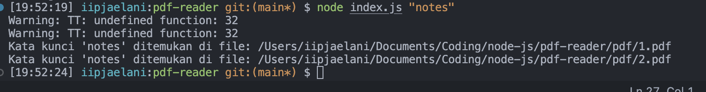

# Multiple PDF reader

---

This is a simple js script to read multiple PDF files and extract the text from them, solution for easy to find some keyword in multiple PDF files.



## How to use

Start with the following command by cloning the repository:

```
git clone https://github.com/iip-jaelani16/pdf-search
```

Install the dependencies with the following command:

```
npm install
```

Then, run the script with the following command:

```
node index.js (keyword)
// example: node index.js "hello world"
```
